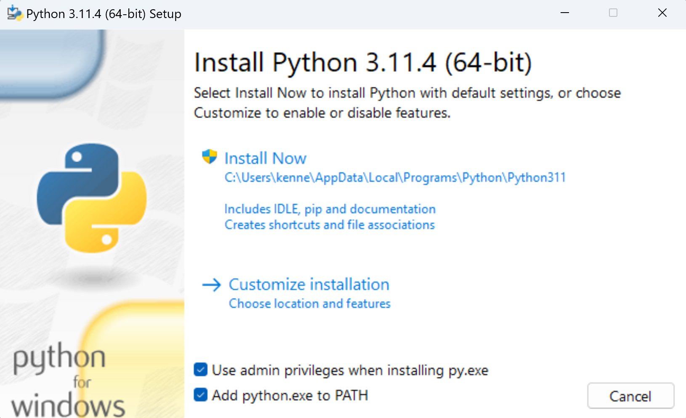

# How to install and Run Python on Windows
The official documentation for Python on Windows is [here](https://docs.python.org/3/using/windows.html). 

## Check For Existing Installations
Before starting an it is worth checking if there are any existing python installations. We can do this by running the following command from any terminal. 

```
where python
```

On my machine I got back the following. 

```
C:\Python310\python.exe
%LOCALAPPDATA%\Programs\Python\Python311\python.exe
%LOCALAPPDATA%\\Microsoft\WindowsApps\python.exe
```

Which I subsequently deleted. 

## Installing

The python documentation states

The full installer contains all components and is the best option for developers using Python for any kind of project.

So we use that one. Note I have ticked Add python.exe to PATH and by default it will install to

%LOCALAPPDATA%\Programs\Python\Python311




## Check Where The Executables Live Now
Run
```
where python 
```

I see 

```
%LOCALAPPDATA%\Programs\Python\Python311\python.exe
%LOCALAPPDATA%\\Microsoft\WindowsApps\python.exe
```

If I run 

```python --version```

I get back

```
Python 3.11.4
```

## Environment Variables
The install adds the following to the users PATH 

* %LOCALAPPDATA%\Programs\Python\Python311\
* %LOCALAPPDATA%\Programs\Python\Python311\Scripts

The first makes python.exe availabe on the path and the second makes pip, the python package installer, available on the path.


